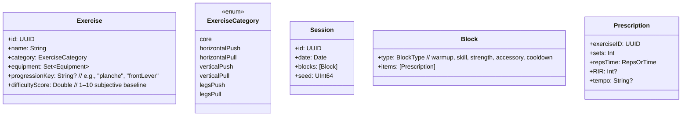

//
//  README.md
//  New Project
//
//  Created by Celeste van Dokkum on 10/14/25.
//

# Calisthenics Workout Generator (iOS)

A Swift/SwiftUI app that tracks your calisthenics progress over time and auto‑generates workouts tailored to the equipment you have available to you, your current abilities and your goals. 


gif of each page

gif of transitioning between pages


---

## Tech Stack

* **Language**: Swift 5.9+
* **UI**: SwiftUI (iOS 17+)
* **State**: Observable/Environment models (unidirectional data flow)
* **Persistence**: Core Data (SQLite) or SwiftData (toggleable)
* **Scheduling**: BackgroundTasks (optional)
* **Health**: HealthKit (optional; calories/HR import)
* **Testing**: XCTest + SnapshotTesting

> You can flip between **Core Data** and **SwiftData** by changing the `PersistenceMode` flag in `AppConfig.swift`.

---

## Project Structure

```
CalisthenicsApp/
├─ App/
│  ├─ CalisthenicsApp.swift
│  ├─ AppConfig.swift
│  └─ DIContainer.swift
├─ Features/
│  ├─ Generator/
│  │  ├─ WorkoutGenerator.swift
│  │  ├─ Heuristics/
│  │  │  ├─ProgressionHeuristic.swift
│  │  │  ├─FatigueHeuristic.swift
│  │  │  └─EquipmentHeuristic.swift
│  ├─ Tracking/
│  │  ├─ SessionRecorderView.swift
│  │  └─ PRService.swift
│  ├─ Skills/
│  │  ├─ SkillTreeView.swift
│  │  └─ SkillGraph.swift
│  └─ Analytics/
│     ├─ DashboardView.swift
│     └─ TrendsService.swift
├─ Models/
│  ├─ Exercise.swift
│  ├─ ExerciseCategory.swift
│  ├─ Session.swift
│  ├─ SetRecord.swift
│  └─ SkillNode.swift
├─ Persistence/
│  ├─ CoreDataStack.swift
│  ├─ SwiftDataStack.swift
│  └─ Migrations/
├─ Resources/
│  ├─ exercises.json
│  └─ seeds/
└─ Tests/
   ├─ GeneratorTests.swift
   └─ SnapshotTests/
```

---

## 🧩 Domain Model



**Equipment**: `rings`, `bar`, `parallettes`, `floor`, `bands`

**Categories** (used by generator + analytics):

* `core`
* `horizontalPush` (push‑ups, planche variants)
* `horizontalPull` (rows)
* `verticalPush` (HS push‑ups, pike presses)
* `verticalPull` (pull‑ups, front lever)
* `legsPush` (squats/lunges)
* `legsPull` (hinge/nordics)

---

## ⚙️ Workout Generation (overview)

1. **Constraints collected**: available time, equipment, focus categories, soreness, target difficulty band
2. **Template selection**: e.g. `FullBody( Skill → StrengthA → StrengthB → Accessory )`
3. **Candidate pool** filtered by **category** & **equipment**
4. **Scoring** per exercise:

   * **Fatigue budget** (recent work, soreness)
   * **Progression readiness** (skill prerequisites met?)
   * **Novelty** penalty to avoid repeats
   * **User affinity** (liked/skipped)
5. **Seeded tie‑break** with `seed` for reproducibility
6. **Dose assignment** using a target **Session Difficulty Index (SDI)**
7. **Validation**: ensure category coverage + RPE caps

> See `Features/Generator/WorkoutGenerator.swift` for composable heuristics and the deterministic RNG wrapper.

---

## 🗂️ Seed Data (excerpt)

```json
[
  {
    "id": "41c3…",
    "name": "Pseudo Planche Push‑up",
    "category": "horizontalPush",
    "equipment": ["floor", "parallettes"],
    "progressionKey": "planche",
    "difficultyScore": 6.5
  },
  {
    "id": "7f9a…",
    "name": "Tuck Front Lever Hold",
    "category": "verticalPull",
    "equipment": ["bar", "rings"],
    "progressionKey": "frontLever",
    "difficultyScore": 6.0
  }
]
```

---

## 🚀 Getting Started

### Requirements

* macOS 13+
* Xcode 15+
* iOS 17+ target (adjust `IPHONEOS_DEPLOYMENT_TARGET` if needed)

### Build & Run

1. `git clone https://github.com/your‑org/calisthenics‑app.git`
2. Open `CalisthenicsApp.xcodeproj` (or `.xcworkspace` if using packages)
3. Select a simulator or your device, then **Run**

### Configuration

* **AppConfig.swift**: toggle persistence mode, HealthKit on/off, default generator template
* **exercises.json**: add or edit exercises and categories
* **seeds/**: put sample sessions for demo accounts

---

## 🧪 Tests

* `GeneratorTests` validate:

  * category coverage constraints
  * determinism under fixed seeds
  * overload & deload schedule rules
* Snapshot tests for key screens (optional)

Run in Xcode (⌘‑U) or via CLI:

```bash
xcodebuild test \
  -scheme CalisthenicsApp \
  -destination 'platform=iOS Simulator,name=iPhone 15'
```

---

## 🔒 Privacy

* Local‑only by default. HealthKit is **opt‑in** and read‑only.
* No analytics unless you enable the `AnalyticsProvider` and supply keys.

---

## 🧭 Roadmap

* [ ] Super‑set suggestions during plateau
* [ ] Session “time box” auto‑rebalance
* [ ] iCloud sync (CloudKit)
* [ ] Export to CSV / Apple Numbers
* [ ] Widgets + Live Activities
* [ ] Coach voice prompts

---

## 🤝 Contributing

1. Fork the repo
2. Create a feature branch: `git checkout -b feature/awesome`
3. Commit changes with clear messages
4. Open a PR describing your approach and screenshots

Coding guidelines:

* Prefer **expanded variable names** for clarity
* Keep generator heuristics **pure** where possible (testable)
* UI in SwiftUI; avoid UIKit unless necessary

---

## 📄 License

This project is licensed under the MIT License — see `LICENSE` for details.

---

## 📸 Screenshots (placeholders)

* `Docs/Screenshots/dashboard.png`
* `Docs/Screenshots/generator.png`
* `Docs/Screenshots/skill‑tree.png`

---

## 🙏 Acknowledgements
          
todo

Essentials / easy
- Add prerequisites to workout generation
- Improve workout generation / make it a little smarter

Harder
- Swapping out of exercises, ratings?
- Click on exercise to pull up description
- I’m injured button

MONGODB
- Adding data
- Accessing data
- Setting up auth
- Setting up user data
- Linking everything together

Calendar !

Ongoing quests / achievements

Long terms stats over time

Interactive workout mode
- Click the number of reps you were able to complete

Opt:
- Planche level etc
- Add progress bars under horizontal push, vertical push, etc
- Resources on form for each exercise


Inspired by the Bodyweight Fitness community and classic calisthenics progressions. Thanks to contributors who provided exercise datasets and testing feedback.


